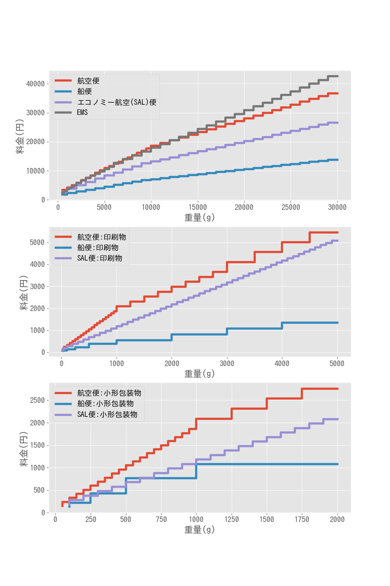

# 英国に小包を送るのに一番ベストな方法を探します。

## 前提

### 通常郵便物
英国は `第2地帯(オセアニア、中近東、北米、中米、西インド諸島、ヨーロッパ)`　になります。

通常郵便物は、はがき、手紙、グリーティングカード、印刷物、小形包装物、盲人用郵便物が該当しますが、
ここでは、
- 印刷物
- 小型包装物
のみ対象にします。

### 国際小包
英国は `第3地帯(オセアニア、中近東、北米、中米、西インド諸島、ヨーロッパ)`　になります。

国際小包は、荷物（小包）のように、手紙のように通信の性質のあるもの以外の物品を送るための郵便物です。

### EMS（国際スピード郵便）
英国は `第2-2地帯 ヨーロッパ)`　になります。

EMSは、国際郵便の中で最優先の取り扱いにより、お預かりした書類や荷物をスピーディーにお届けするサービスです。


## 方法
日本郵政の[海外の料金表](https://www.post.japanpost.jp/int/charge/list/)をデータを取得し、pandasデータフレームにし、プロットします。


###　料金表を取得

まず、国際小包とEMSの表を取得します。
```
# 国際小包
s = getTable("https://www.post.japanpost.jp/int/charge/list/parcel3.html")
key = s.check_order()  # テーブルのタイトルを取得
results = s.maketable() # データフレーム生成生成
df_parcel3 = {k:convertUnits(results[i][0]) for i,k in enumerate(key[:3])}

# EMS
s = getTable("https://www.post.japanpost.jp/int/charge/list/ems3.html")
results = s.maketable() # データフレーム生成
df_parcel3['EMS'] = convertUnits(results[0][0])  #作成したデータフレームを追加
```

#### 通常郵便物の表を取得します。
次に、通常郵便物の表を取得します。
```
s = getTable("https://www.post.japanpost.jp/int/charge/list/normal2.html")
results = s.maketable() # データフレーム形成
```

-　「船便　手紙」「船便　印刷物」の料金表は一部"g"が全角表示になっていたので、修正しています。
-  「船便　特別郵袋印刷物」「船便　印刷物」の料金表には"("が含まれており、括弧内は第三種郵便物および学術刊行物に相当するものの料金に相当するので、今回は削除します。

```
# 全角混ざりを修正
results[9][0].iloc[0]['重量'] = "20gまで"
results[11][0].iloc[0]['重量'] = "20gまで"

# かっこを修正
results[11][0]["料金"] = results[11][0]["料金"].str.extract('\((.*)\)')
results[11][0].iat[0,2] = results[11][0].iloc[1]["料金"]
results[13][0]["料金"] = results[13][0]["料金"].str.extract('(\d,?\d{3})')
```

キーをつけて、データフレームを辞書型でまとめます。
```
# テーブルのタイトルを取得します。第一列のヘッダーと一列一行目を使います。
key = [':'.join([i[0].columns[0], i[0].iloc[0][i[0].columns[0]]]) for i in results]

# どの(何番目の)テーブルを使うか確認します。
for i,k in enumerate(key):
    print(i,k)
    
# '航空便:印刷物', '航空便:小形包装物', '船便:印刷物', '船便:小形包装物', 'SAL便:印刷物', 'SAL便:小形包装物'のみ抽出
df_normal2 = {k:convertUnits(results[i][0]) for i,k in enumerate(key) if i in [3,4,11,12,15,16]} 
```

## プロットする
例として　scriptForPlot.ipynb　を見てください。

 

## 結果

- 15kgまでならEMSを選びましょう。EMSも航空便も料金はほとんど変わりません。
- SAL便は航空便の約3/4くらいで遅れるので、早く（10日〜２週間ほど）重い荷物を送る場合はSAL便が経済的です。
- 本などの印刷物を送る場合は、普通の国際小包にするよりも半額近くで送れます。船便にすれば、かなりお得です。日本語の本で急ぎでない場合は船便でもいいかもしれません(2-3ヶ月かかります)。
- 印刷物になると　SAL便と航空便でほとんど差がなくなりますね。
- 2kg以下の軽い荷物を送りたいときは小形包装物がおすすめです。乾物など送るときに便利そうです。値段的には印刷物を送る場合と変わりませんが、重量制限が2kgになっている点が違います。


